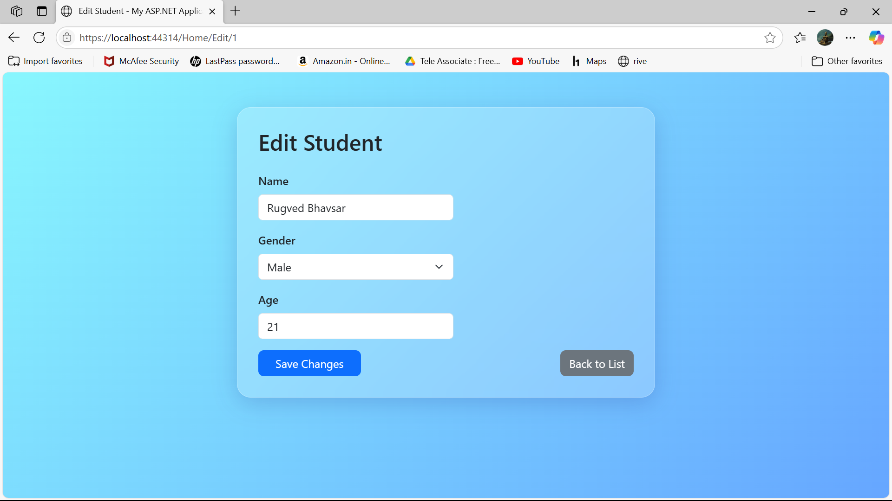

### This project demonstrates the basic CRUD operations (Create, Read, Update, Delete) in an ASP.NET MVC application.

### It uses Entity Framework Code First approach for database management.

### Users can add, view, edit, and delete records through a user-friendly interface.

### Implements data validation and error handling for smooth user experience.

### Supports responsive design for better usability on different devices.

### Demonstrates connection to a SQL Server database and effective data manipulation.

# Project Output SnapShot

